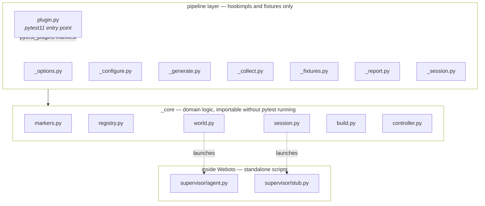
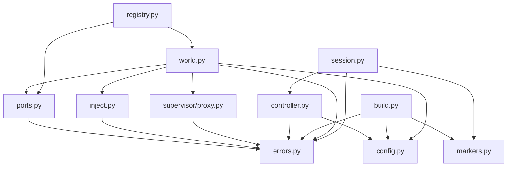
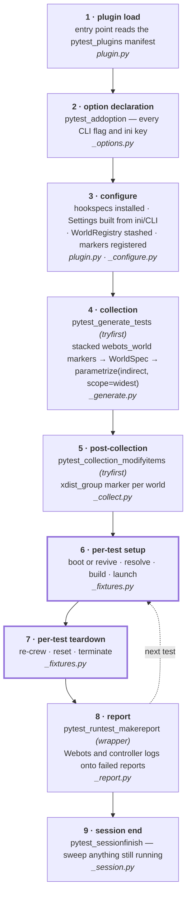
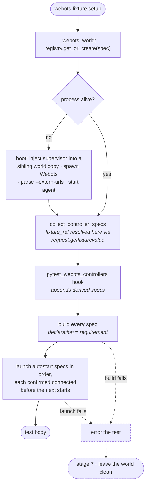
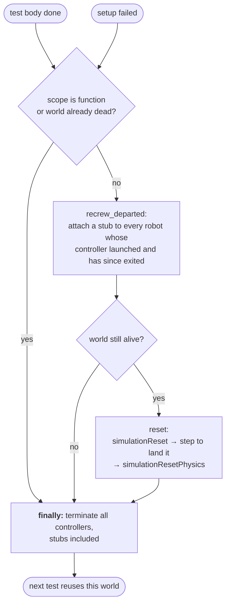
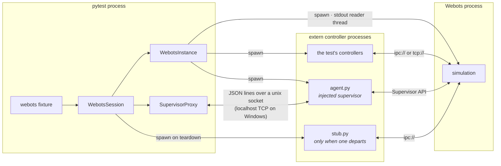
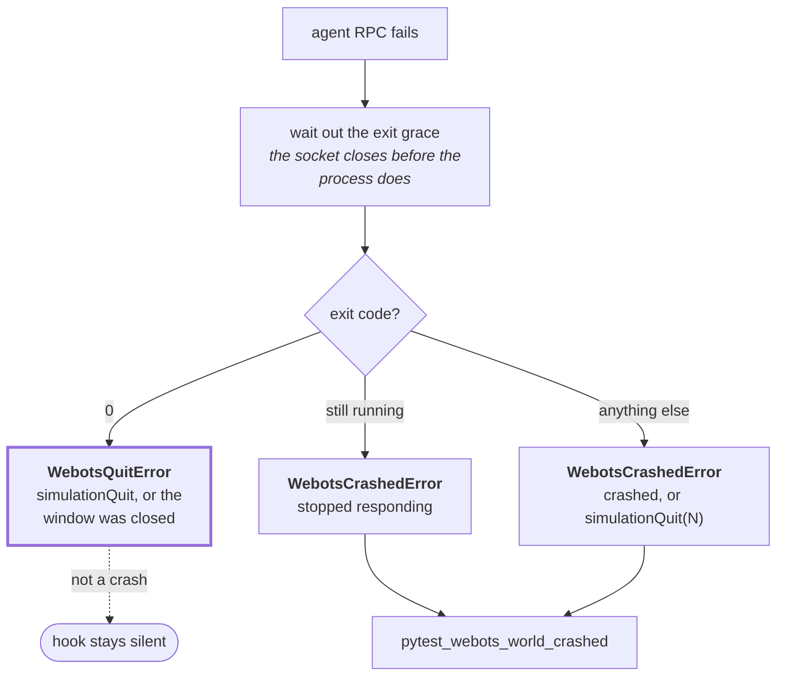

# Design

How pytest-webots is put together: the two-layer package split, where each pytest hook fires, and what runs in which process.

## Two layers

Modules sibling to `plugin.py` are named for the pytest pipeline stage they serve and hold **only** hookimpls and fixtures that delegate. Domain logic lives in `_core/`, which defines no hookimpls and no fixtures.

Pipeline modules import `_core` only, with one exception: `_report` imports the `SESSION_KEY` stash key from `_fixtures`, because that is where the session is stashed onto the item.

Where domain code must fire this plugin's own hooks — `world_started`, `world_stopping`, `world_crashed`, `before/after_reset` and `world_args` all originate inside `WebotsInstance` — `_core` declares a `WorldHooks` **Protocol** and takes an implementation at construction. `_configure` supplies the one that relays to `config.hook`; the `NoHooks` default means an instance built without an observer still runs, so no call site needs a null guard. That keeps `_core` free of any pytest coupling beyond types, and a world is fully wired the moment it exists rather than after two other modules finish assigning to it.

The notification passes the instance rather than closing over it, which is what lets the implementation be constructed before any world is.

`supervisor/agent.py` and `supervisor/stub.py` run **inside Webots** as extern controllers. They import only the standard library and the Webots-bundled `controller` package, never `pytest_webots` itself.

### `_core` dependency direction

`errors.py` and `config.py` are the base and do not depend on each other — `config` raises `pytest.UsageError` for user-facing misconfiguration, while `errors` carries runtime failures. `markers.py` has no runtime dependency on the others; it imports `config` only under `TYPE_CHECKING`.

## Pipeline stages

`pytest_generate_tests` is `tryfirst` so the world parameter is applied before the builtin `parametrize` marks and therefore leads test ids. `pytest_collection_modifyitems` is `tryfirst` so xdist's later-registered worker implementation sees the markers. Grouping same-world tests is then pytest's own `reorder_items`, not ours.

### Stage 6 — setup

Builds run before any launch so a failure surfaces while nothing is connected. Build results are cached against a source digest — **including failures**, so a broken controller fails every test declaring it while only the first pays for the build.

Neither failure has its own recovery: both fall into the same teardown as a test that finished normally, which is what lets a failed setup keep the world rather than spend a reboot on it.

### Stage 7 — teardown

One path, entered from a finished test body and from a failed setup alike. The ordering is load-bearing and non-obvious.

Three constraints shape it:

- **The reset happens while controllers are connected.** Webots blocks stepping on a `synchronization TRUE` robot with nobody attached, and the reset's landing step is a step like any other. Terminating first would hang it.
- **A departed controller is re-crewed, not tolerated.** Webots keeps a departed robot's slot open and waits for a new connection, so a controller that legitimately finishes its work — a game reaching game over — would otherwise stall the reset until the agent socket times out. A stub reconnects in about 60 ms; without it the teardown costs 30 seconds and a misdiagnosed crash. Stubs are used rather than restarting the real controller so no user code re-runs.
- **A failed setup takes this path too, rather than a recovery of its own.** A launch that fails leaves controllers terminated but still on the session, which is exactly the shape re-crewing handles, so the world is reset and kept instead of shut down. A build that fails launched nothing, so re-crewing finds nothing and the reset is a formality.

Termination sits in a `finally` so a failed reset cannot strand the test's controllers.

## Process model

One Webots process per distinct `WorldSpec`, booted from a temporary sibling copy of the world with a supervisor robot appended, reused across the tests that share it and reset in between.

**One stdout stream carries everything.** Readiness, robot discovery, and controller connection tracking are all parsed from the stream Webots is launched with — `--extern-urls` plus the extern-controller connect and disconnect notices. Readiness is the injected supervisor announcing its URL; because it sits last in the world file, every other robot has been discovered by then.

**Connection waits cannot be satisfied by stale state.** Each robot has a monotonically increasing connect generation. A launch snapshots the generation first and then waits for a higher one, so a connection from a previous test can never count — and a controller that connects and finishes inside one poll interval still counts as started.

**`WebotsInstance` outlives its process.** Crashes surface as `WebotsCrashedError` for the test that hit them, and the next test gets a reboot, bounded by `webots_max_restarts` consecutive boot failures. Webots runs in its own process group; on Linux the binary is a wrapper script, so group kills are needed to catch its child.

**How a failure ended decides what the caller is told.** A failed agent RPC means the instance is finished, but not why.

The grace period is what separates "quit" from "hung": the agent socket closes before the process finishes exiting, so polling the instant an RPC fails would report every clean quit as merely unresponsive. A non-zero code stays ambiguous — `simulationQuit(3)` and a genuine crash both surface as `3`, and nothing in the output separates them — so the message names both rather than guessing.

### The agent

`supervisor/agent.py` serves the Supervisor API to the test process. Its ops live in a dispatch table: built-ins (`step`, `reset`, `reload`, `call`, `release`, …) plus anything `webots_agent_plugins` files register through `register(agent)`. A plugin may replace an op registered by an earlier plugin, but claiming a built-in name raises.

Requests are decoded and results encoded centrally, so a plugin op exchanges Webots objects with the test as handles and proxies exactly like the built-in `call` op does. `SupervisorProxy` on the pytest side turns those handles back into chainable objects.

## Ports and xdist

Under xdist, workers each collect for themselves and run every stage independently. The worker id offsets the port base each worker scans upward from, and the port alone isolates workers — it is part of the IPC rendezvous path, so overriding `WEBOTS_TMPDIR` would break the rendezvous on Linux rather than help.

Ports are never reissued once handed out, so an instance can shut down and reboot without another world claiming its number. A port two processes race for resolves itself: Webots retries upward, announces the port it settled on, and the instance follows the announcement rather than its own request.

## Test layout

`tests/` mirrors the package split.

`tests/core/` tests the domain layer directly — `pytest`, a stubbed `subprocess.Popen`, or a real Webots instance constructed by hand, but never the plugin's own hooks. There is one module per `_core` module with standalone logic worth isolating: `test_build`, `test_config`, `test_markers`, `test_ports`, `test_registry`, `test_world`, `test_controller`, `test_session`, `test_agent`.

The files above it are named for the pipeline stage they drive through pytest itself, mostly via `pytester`: `test_generate`, `test_collect`, `test_fixtures`, `test_controllers` (the controller half of stage 6), `test_report`. Shared helpers are fixtures in `tests/conftest.py`, so a test module never imports another.

Worlds in `tests/worlds/` cover both scheduling modes deliberately. `sync.wbt` holds a `synchronization TRUE` robot: without one, a departed controller never blocks, and the whole class of teardown stalls goes undetected.
